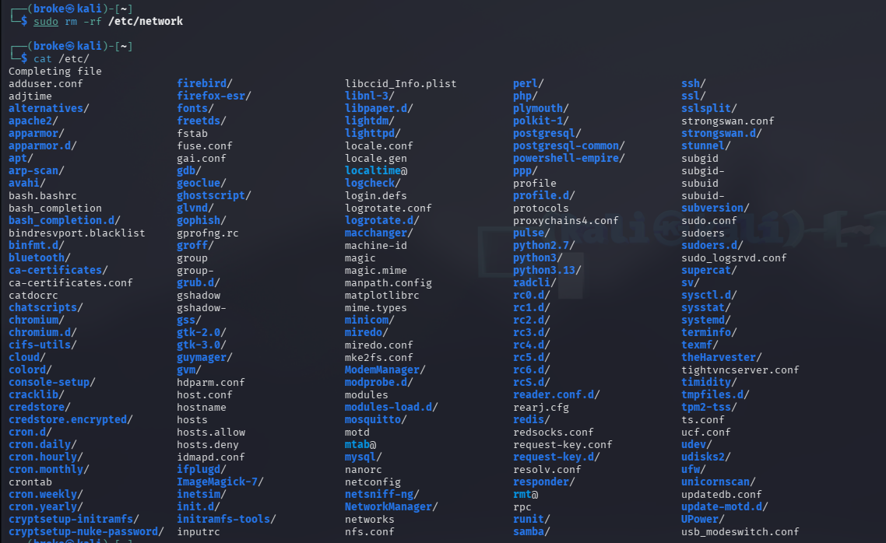
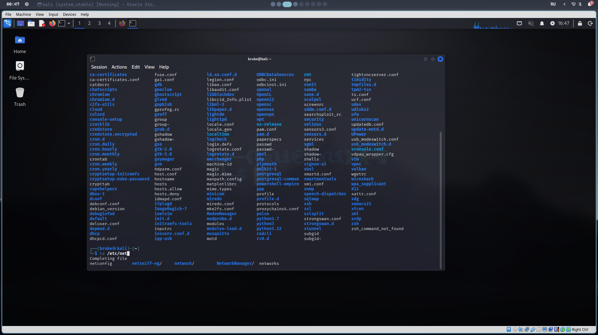
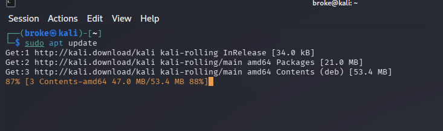

# Course-homework1

## Pictures





### Tasks

```bash
┌──(broke㉿kali)-[~]
└─$ pwd
/home/broke

┌──(broke㉿kali)-[~]
└─$ ls -la
total 1740
drwx------ 21 broke broke   4096 Mar 31 16:28 .
drwxr-xr-x  3 root  root    4096 Feb  8 04:48 ..
-rw-r--r--  1 broke broke    220 Feb  8 04:48 .bash_logout
-rw-r--r--  1 broke broke   5551 Feb  8 04:48 .bashrc
-rw-r--r--  1 broke broke   3526 Feb  8 04:48 .bashrc.original
drwx------  7 broke broke   4096 Mar 22 04:44 .BurpSuite
drwxrwxr-x 17 broke broke   4096 Mar 30 13:55 .cache
drwxr-xr-x 18 broke broke   4096 Mar 30 13:55 .config
drwxr-xr-x  2 broke broke   4096 Feb  8 04:53 Desktop
-rw-r--r--  1 broke broke     35 Feb  8 04:53 .dmrc
drwxr-xr-x  2 broke broke   4096 Mar 17 16:24 Documents
drwxr-xr-x  2 broke broke   4096 Mar 20 06:13 Downloads
-rw-r--r--  1 broke broke  11759 Feb  8 04:48 .face
lrwxrwxrwx  1 broke broke      5 Feb  8 04:48 .face.icon -> .face
drwx------  3 broke broke   4096 Feb  8 04:53 .gnupg
-rw-------  1 broke broke      0 Feb  8 04:53 .ICEauthority
drwxr-xr-x  4 broke broke   4096 Feb  9 17:43 .java
-rwxr-xr-x  1 broke broke 971926 Feb 13 17:44 linpeas.sh
drwxr-xr-x  6 broke broke   4096 Mar 26 17:22 .local
drwx------  5 broke broke   4096 Feb  8 04:55 .mozilla
drwxrwxr-x 12 broke broke   4096 Feb 13 17:52 .msf4
drwxr-xr-x  2 broke broke   4096 Feb  8 04:53 Music
drwxrwxr-x  2 broke broke   4096 Feb 13 16:57 NewFolder
drwxr-xr-x  2 broke broke   4096 Feb  8 04:53 Pictures
-rw-r--r--  1 broke broke    807 Feb  8 04:48 .profile
drwxr-xr-x  2 broke broke   4096 Feb  8 04:53 Public
-rw-rw-r--  1 broke broke    525 Feb 13 17:10 request
drwxrwxr-x 14 broke broke   4096 Mar 17 16:30 SecLists
drwx------  3 broke broke   4096 Feb  8 04:53 .ssh
-rw-r--r--  1 broke broke      0 Feb  8 04:55 .sudo_as_admin_successful
drwxr-xr-x  2 broke broke   4096 Feb  8 04:53 Templates
-rw-r-----  1 broke broke      5 Mar 31 16:27 .vboxclient-clipboard-tty7-control.pid
-rw-r-----  1 broke broke      5 Mar 31 16:27 .vboxclient-clipboard-tty7-service.pid
-rw-r-----  1 broke broke      5 Mar 31 16:27 .vboxclient-draganddrop-tty7-control.pid
-rw-r-----  1 broke broke      5 Mar 31 16:27 .vboxclient-draganddrop-tty7-service.pid
-rw-r-----  1 broke broke      5 Mar 31 16:27 .vboxclient-hostversion-tty7-control.pid
-rw-r-----  1 broke broke      5 Mar 31 16:27 .vboxclient-seamless-tty7-control.pid
-rw-r-----  1 broke broke      5 Mar 31 16:27 .vboxclient-seamless-tty7-service.pid
-rw-r-----  1 broke broke      5 Mar 31 16:27 .vboxclient-vmsvga-session-tty7-control.pid
-rw-r-----  1 broke broke      5 Mar 31 16:27 .vboxclient-vmsvga-session-tty7-service.pid
drwxr-xr-x  2 broke broke   4096 Feb  8 04:53 Videos
-rw-------  1 broke broke    986 Feb 13 16:43 .viminfo
-rw-rw-r--  1 broke broke 588888 Feb 13 16:59 wordlist
-rw-------  1 broke broke     49 Mar 31 16:27 .Xauthority
-rw-------  1 broke broke   4898 Mar 31 16:29 .xsession-errors
-rw-------  1 broke broke   4826 Mar 31 16:16 .xsession-errors.old
-rw-r--r--  1 broke broke    336 Feb  8 04:48 .zprofile
-rw-rw-r--  1 broke broke   4196 Mar 26 17:37 .zsh_history
-rw-------  1 broke broke    484 Feb  9 17:28 .zsh_history_bad
-rw-r--r--  1 broke broke  10855 Feb 13 16:43 .zshrc

┌──(broke㉿kali)-[~]
└─$ mkdir -p course/homework


┌──(broke㉿kali)-[~]
└─$ ls course
homework


┌──(broke㉿kali)-[~]
└─$ rmdir  course/homework

┌──(broke㉿kali)-[~]
└─$ rmdir course


┌──(broke㉿kali)-[~]
└─$ ls
Desktop  Documents  Downloads  linpeas.sh  Music  NewFolder  Pictures  Public  request  SecLists  Templates  Videos  wordlist


┌──(broke㉿kali)-[~]
└─$ touch file.txt

┌──(broke㉿kali)-[~]
└─$ vim file.txt

┌──(broke㉿kali)-[~]
└─$ cat file.txt
ПРИВЕТ
строчка2
строчка3
строчка4
строчка5
строчка6
строчка7
строчка8

┌──(broke㉿kali)-[~]
└─$ head -n 3 file.txt
ПРИВЕТ
строчка2
строчка3
┌──(broke㉿kali)-[~]
└─$ tail -n 3 file.txt
строчка7
строчка8

┌──(broke㉿kali)-[~]
└─$ rm file.txt

```

### Task 5

```bash
 sudo cat /etc/sudoers
#
# This file MUST be edited with the 'visudo' command as root.
#
# Please consider adding local content in /etc/sudoers.d/ instead of
# directly modifying this file.
#
# See the man page for details on how to write a sudoers file.
#
Defaults        env_reset
Defaults        secure_path="/usr/local/sbin:/usr/local/bin:/usr/sbin:/usr/bin:/sbin:/bin"

# This fixes CVE-2005-4890 and possibly breaks some versions of kdesu
# (#1011624, https://bugs.kde.org/show_bug.cgi?id=452532)
Defaults        use_pty

# This causes mail to be sent to the mailto user if the user running
# sudo does not enter the correct password. This is off in Debian by
# default since Debian 14.
#Defaults       mail_badpass

# This preserves proxy settings from user environments of root
# equivalent users (group sudo)
#Defaults:%sudo env_keep += "http_proxy https_proxy ftp_proxy all_proxy no_proxy"

# This allows running arbitrary commands, but so does ALL, and it means
# different sudoers have their choice of editor respected.
#Defaults:%sudo env_keep += "EDITOR"

# Completely harmless preservation of a user preference.
#Defaults:%sudo env_keep += "GREP_COLOR"

# While you shouldn't normally run git as root, you need to with etckeeper
#Defaults:%sudo env_keep += "GIT_AUTHOR_* GIT_COMMITTER_*"

# Per-user preferences; root won't have sensible values for them.
#Defaults:%sudo env_keep += "EMAIL DEBEMAIL DEBFULLNAME"

# "sudo scp" or "sudo rsync" should be able to use your SSH agent.
#Defaults:%sudo env_keep += "SSH_AGENT_PID SSH_AUTH_SOCK"

# Ditto for GPG agent
#Defaults:%sudo env_keep += "GPG_AGENT_INFO"

# Host alias specification

# User alias specification

# Cmnd alias specification

# User privilege specification
root    ALL=(ALL:ALL) ALL

# Allow members of group sudo to execute any command
%sudo   ALL=(ALL:ALL) NOPASSWD:ALL

# See sudoers(5) for more information on "@include" directives:

@includedir /etc/sudoers.d

```
